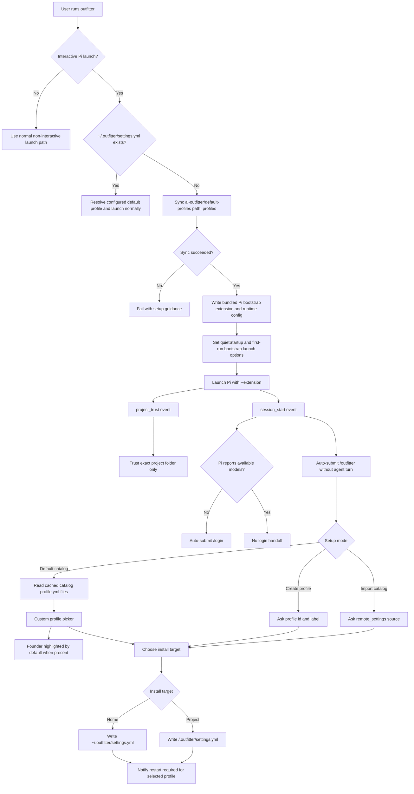

# Onboarding Architecture

## Purpose

This document describes the current Pi-native Outfitter onboarding path. It is architecture documentation, not product copy: it explains the runtime decisions, bundled Pi extension responsibilities, catalog source-of-truth, and custom UI behavior that keep first-run setup native to Pi without requiring an agent/model turn.

## Current First-Run Flow

A plain interactive `outfitter` launch uses Pi-native onboarding only when Outfitter cannot find `~/.outfitter/settings.yml`. Existing settings use the normal run path. Non-interactive Pi launches (`--print`, `-p`, `--export`, `--list-models`, JSON/print/RPC modes) MUST NOT open onboarding UI, auto-submit slash commands, sync first-run sources, or mutate Outfitter settings.

When first-run onboarding is active, `RunCommand` synchronizes the default profile catalog from `github: ai-outfitter/default-profiles` with `path: profiles`. The bundled Pi bootstrap extension receives the synced cache path as `defaultProfilesPath` through its JSON runtime config. The extension reads profile `id`, `label`, and `description` from cached catalog `profile.yml` files at runtime; profile picker entries are not hardcoded in the extension.

Before Pi starts, Outfitter writes the pre-built extension artifact (compiled TypeScript from `code/pi-extension`, bundled as `outfitter-extension.js`) plus an `outfitter-extension.config.json` runtime config into the Pi config directory, and prepares the launch environment:

- The bundled extension registers `/outfitter` with `pi.registerCommand("outfitter", ...)`.
- The launch plan includes the bundled extension with `--extension`, and the `OUTFITTER_PI_EXTENSION_CONFIG` environment variable points at the JSON runtime config (settings paths, catalog cache path, and onboarding flags are passed as data, not interpolated source).
- First-run onboarding writes Pi `settings.json` with `quietStartup: true` in the bootstrap Pi config directory so Pi startup resource listings stay quiet.
- First-run onboarding injects a temporary bootstrap model argument when needed to avoid Pi's pre-login no-model warning before the extension can open `/login`.
- The extension handles Pi `project_trust` and remembers trust for the exact project folder only. It returns `undecided` for parent folders and all non-first-run launches.

The extension opens `/outfitter` after Pi session start by setting the editor text and submitting Enter through a non-capturing hidden custom UI. This dispatches Pi's native slash command machinery without sending an agent message. If Pi reports no available models through `ctx.modelRegistry.getAvailable()` or equivalent runtime state, the extension renders an Outfitter question box explaining that Pi does not have a model provider connected yet, then opens Pi's native `/login` flow when the user chooses to continue. Outfitter never asks for or stores provider credentials.

## Mermaid Flowchart



## Native Command and Agent-Turn Boundary

`/outfitter` is a Pi extension command, not a prompt sent to the active model. The extension command owns all onboarding UI and filesystem writes. This boundary matters because first-run setup must work before the user has configured model credentials.

The bootstrap extension uses `ctx.ui.setEditorText("/outfitter")` plus a hidden `ctx.ui.custom(...)` component that submits Enter. That lets Pi's slash-command dispatcher run the extension command while avoiding a visible notification that Outfitter is opening setup. The same mechanism opens `/login` only after runtime model availability checks indicate no available models. Before the `/login` handoff, Outfitter SHOULD render a question box that says: "Pi does not have a model provider connected yet. Connect one now so Outfitter can use Pi. Credentials stay inside Pi." This copy SHOULD NOT be emitted as a main-body notification.

## Custom Profile Picker Nuance

Pi's public extension UI selector has a deliberately simple shape:

```ts
ctx.ui.select(title: string, options: string[]): Promise<string | undefined>
```

That API can show a shared title and a flat list of strings, but it cannot attach a per-option description that updates beside the highlighted row. Outfitter therefore uses `ctx.ui.custom(...)` only for the profile picker.

The custom picker uses a purpose-specific custom UI helper named `selectDescribedOption`. The name intentionally avoids a generic `customSelect` label: this component exists for option lists where the highlighted row owns a secondary description. It should be reused for onboarding choices that need per-option explanatory text, including the install-target screen.

The described-option selector renders:

- the fixed profile-setup title and guidance;
- one selectable row per synced catalog profile;
- only the selected profile's `description` to the right of that row;
- no description text for profiles without a `description` field;
- `↑`/`↓` navigation, Enter selection, and Escape/Ctrl+C cancellation.

The picker initializes on the current configured default profile when one exists. If no current default exists and `founder` is present in the synced catalog, it initializes on `founder` and labels it as recommended. Otherwise it initializes on the first sorted profile. Sorting still keeps `founder` first when present, then sorts remaining profiles by id.

Example shape:

```text
Outfitter profile setup

Choose the default profile from the selected catalog for future 'outfitter' launches.
The current Pi process keeps the profile it started with; this setting applies on the next launch.

→ founder — Founder (Recommended)  Founder-operator setup for building, product thinking, research checks, dense prose, and careful delivery.
  data_analyst — Data Analyst
  engineer — Engineer
```

## Setup Modes and Writes

The first onboarding question chooses one setup mode:

1. **Use the default Outfitter profile catalog** reads profile choices from the synced `ai-outfitter/default-profiles` cache, then writes `default_profile` and default `profile_sources` to the selected install target.
2. **Create your own profile** asks for a profile id and label, writes settings for a local profile source, and creates `<install-target>/.outfitter/profiles/<profile>/profile.yml` only if that file does not already exist.
3. **Provide a different catalog to import** writes `remote_settings` pointing at the user-provided `owner/repo`, `ref`, and settings path. Before writing, the extension checks GitHub repository metadata. Only HTTP 200 with JSON `private: true` is treated as confirmed private; public, unknown, 403/404, network, malformed, and non-GitHub outcomes do not warn, error, or block.

Private catalog enablement is sourced only from `~/.outfitter/settings.yml`:

```yaml
enterprise:
  private_profile_catalogs: true
```

If that setting is absent and an imported GitHub catalog is confirmed private, Pi-native onboarding asks:

```text
Private GitHub profile catalog detected: OWNER/REPO.

Private profile catalog support is covered by the Outfitter Enterprise license.
Review code/enterprise/LICENSE or your enterprise agreement before enabling.

Enable private profile catalogs in ~/.outfitter/settings.yml and use this catalog?
```

The choices are:

```text
Enable and continue
Cancel private catalog setup
```

Accepting writes the home setting and notifies:

```text
Outfitter enabled private profile catalogs in ~/.outfitter/settings.yml and saved this catalog.
```

Declining leaves all settings unchanged and notifies:

```text
Private catalog setup was cancelled; no settings were changed.
```

If the home setting is already enabled, onboarding skips the private-catalog enterprise prompt and saves the catalog normally. Outfitter does not collect, echo, persist, synthesize, or validate provider credentials.

The final install target question writes either `~/.outfitter/settings.yml` or `<project>/.outfitter/settings.yml`. Profile changes selected after Pi has already started apply to the next `outfitter` launch, so onboarding must communicate that restart boundary.

The install target prompt SHOULD also use `selectDescribedOption`, because the distinction between user-wide and project-local settings is semantic, not just locational. Required copy:

- Home folder: "These profiles will be available anywhere you start outfitter."
- Current project directory: "These profiles will only be available in the current project directory and will compose the profiles of the same name in the home folder."

### Install Target Screen Variations

Variation A keeps the same inline-description pattern as the profile picker and emphasizes the selected row only:

```text
Where should Outfitter install these settings?

  Home folder (~/.outfitter)
→ Current project directory (.outfitter)  These profiles will only be available in the current project directory and will compose the profiles of the same name in the home folder.
```

Variation B uses a wider label column so the explanatory text starts at a stable position:

```text
Where should Outfitter install these settings?

  Home folder (~/.outfitter)
→ Current project directory (.outfitter)    These profiles will only be available in the current project directory and will compose the profiles of the same name in the home folder.
```

Variation C adds one line of neutral guidance above the selector while still keeping descriptions tied to the highlighted row:

```text
Where should Outfitter install these settings?
Choose the scope for the settings.yml written by this setup flow.

→ Home folder (~/.outfitter)              These profiles will be available anywhere you start outfitter.
  Current project directory (.outfitter)
```

Variation D favors a compact two-column layout and is the preferred architecture target when terminal width allows it:

```text
Where should Outfitter install these settings?

  Home folder (~/.outfitter)
→ Current project directory (.outfitter)  These profiles will only be available in the current project directory and will compose the profiles of the same name in the home folder.
```

If terminal width is too narrow, the selected description SHOULD wrap below the highlighted row rather than truncating the scope explanation.

## Cache and Staleness Implications

The default catalog is a remote source, but the profile picker reads the synchronized local cache passed to the bundled extension through its runtime config. If the upstream default-profiles repository changes, an existing cache can remain stale until sync refreshes it. Seeing a removed profile in the picker usually means the first-run process is reading an old cache or a stuck sync process, not that the extension has hardcoded that profile.
