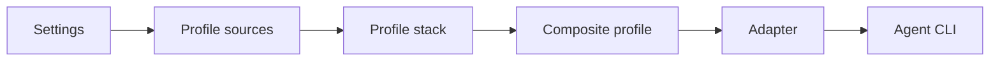

# Concepts

How an `outfitter` launch goes from configuration files to a running agent:

Settings tell Outfitter where profiles come from; profile sources supply profile definitions; the definitions for the selected profile form an ordered stack; the merged stack is written out as a composite profile; an adapter translates that composite profile into agent-specific files, flags, and environment variables; and the agent CLI launches with the result.

## Profile

A profile is a named, reusable YAML definition of how an agent should be outfitted: model and provider, thinking level, system and append prompts, skills, extensions, subagents, DeepWork jobs, CLI arguments, and environment variables. Profiles can inherit from other profiles and can live as a flat `<id>.yml` file or a directory with a `profile.yml` plus bundled resources. See [Profiles](./profiles.md).

## Composite profile

A composite profile is the temporary runtime configuration directory Outfitter assembles for one profile and one agent CLI run. It contains the generated files the agent needs, is created under the system temp directory, and is owned by Outfitter for the lifetime of the run — durable state is handled separately (see state persistence below).

## Catalog / profile source

A profile source is any place profiles are loaded from: a local directory (`path:`), a GitHub repository (`github: owner/repo`), or a git URI (`uri:`). A shared repository of profiles is called a catalog (or profile repository). Remote sources are cached under `~/.outfitter/cache/` and updated with `outfitter sync`; they support `ref` pinning and `only`/`except` filters. See [Profile repositories](./profile-repository.md).

## Settings scopes

Outfitter reads `settings.yml` from three local scopes — user (`~/.outfitter/settings.yml`), project (`<project>/.outfitter/settings.yml`), and project-local (`<project>/.outfitter/local/settings.yml`, for personal, uncommitted overrides) — plus cached remote settings supplied by `remote_settings` entries. Settings declare the default profile and agent, profile sources, and other launch behavior.

## Controls

Controls are the generic, agent-neutral knobs a profile sets: `model`, `provider`, `thinking`, `system_prompt`, `append_system_prompt`, `skills`, `extensions`, `args`, `environment`, and more. Profiles can also nest adapter-specific overrides under `controls.pi` or `controls.claude` when one agent needs different values.

## Adapters

An adapter translates generic controls into one agent CLI's native configuration — files, command-line flags, and environment variables. Pi is the primary and most complete adapter; a Claude Code adapter is supported with gaps. When an adapter cannot honor a control it warns to stderr, or fails when `--strict` is set. See the [adapter support matrix](./support-matrix.md) for per-adapter coverage.

## State persistence

Agents write state during a run — auth, native settings, plugins, sessions. Each adapter declares the state paths it understands and how writes are handled (`symlink`, `discard`, `warn`, `error`, or `prompt`), so useful state survives future runs without Outfitter silently copying unknown files. See [State persistence](./state.md).

## Layer precedence

When several layers define the same profile or setting, higher layers win:

1. Project-local (`.outfitter/local/`)
2. Project (`.outfitter/`)
3. User (`~/.outfitter/`)
4. Cached remote sources (in configured source order)
5. Built-in defaults

For profiles, explicitly inherited profiles slot between cached remote sources and built-in defaults, in declared order.
